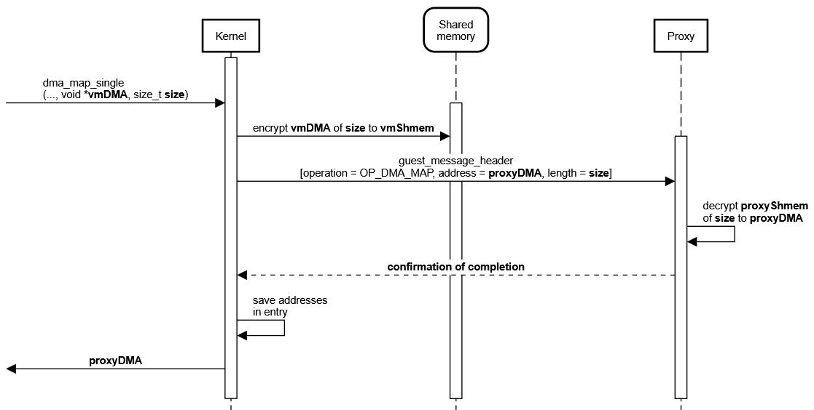
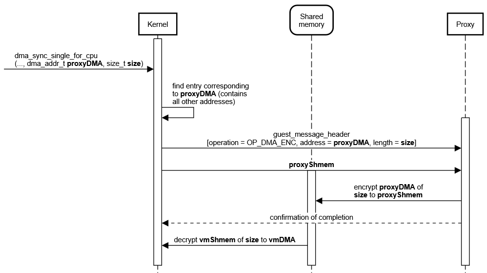
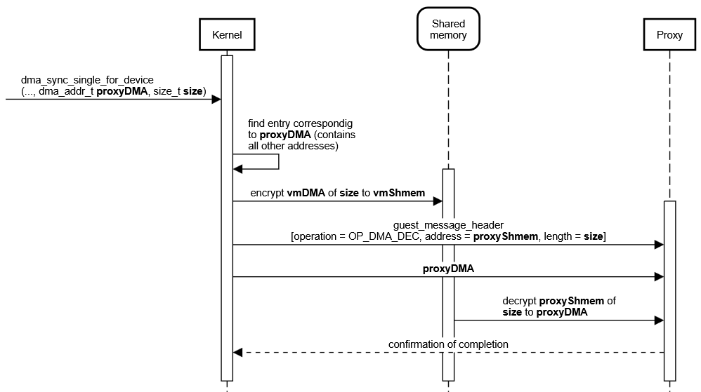
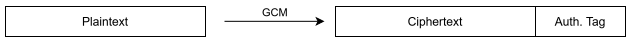

# Secure DMA documentation

This file documents the implementation of the secure DMA communication between VM and proxy process over shared memory.

## Setup

The confidential virtual machine (CVM), which contains the device driver, communicates with the proxy process, which hosts the EDU device.  
The [EDU device](https://www.qemu.org/docs/master/specs/edu.html) is a simple QEMU PCI device supporting basic functionality (e.g. DMA).  
All communication initiated by the driver to the device is intercepted by the kernel and converted into encrypted messages exchanged with the proxy process over the shared memory. This includes memory mapped I/O (MMIO, typically register-size) accesses (not documented here) and direct memory accesses (DMA).  
Right now the proxy process (a QEMU instance) is emulating the EDU device with [libvfio-user](https://github.com/nutanix/libvfio-user).

## Supported kernel DMA API-calls

This section provides information about the DMA-API calls currently supported (implementation details for how this is done are provided [here](#implementation-details-for-dma)):

        dma_addr_t
        dma_map_single(struct device *dev, void *cpu_addr,
                       size_t size, enum dma_data_direction direction)
Expects a physically contigous virtual address of size, which is mapped and can be accessed by the device with the returned address.

        void
        dma_unmap_single(struct device *dev, dma_addr_t dma_addr,
                         size_t size, enum dma_data_direction direction)
Unmaps region which was previously mapped.  
(TODO: does the dma region has to be invalidated?)

        int
        dma_mapping_error(struct device *dev, dma_addr_t dma_addr)
Check if dma_map_single() produced an error. Only valid option to check if dma_map_single was successful.

        void
        dma_sync_single_for_cpu(struct device *dev, dma_addr_t dma_handle,
                                size_t size, enum dma_data_direction direction)
Synchronises the specified region for the cpu, i.e. updates it to the state which the devices currently sees.

        void
        dma_sync_single_for_device(struct device *dev, dma_addr_t dma_handle,
                                   size_t size, enum dma_data_direction direction)
Synchronises the specified region for the device, i.e. updates it to the state which the cpu currently sees.

## Implementation details for DMA

### Addresses overview

In order to understand the details of implementation, one first has to get an overview of the four different addresses:

The shared memory is a PCI device in case of the VM and a file on the host system in case of the proxy. In both scenarios the shared memory is mapped into address space (kernel virtual address space for VM, **vmShmem**; user virtual address space for proxy process, **proxyShmem**). This results in two different addresses for access to the shared memory region.

Additionally to that, there is the virtual address provided to dma_map_single(). This address (**vmDMA**) must have previously been acquired by a call to a kmalloc-like function, and points to a buffer which will be exposed to the device.

And then there is the dma_addr_t address (**proxyDMA**) returned by dma_map_single(), which gives the device access to this in-kernel buffer. This cannot be an address in the shared memory region as this is encrypted. That means there is another memory region in the proxy process, the size of the shared memory DMA region, which contains the unencrypted data. This DMA buffer is allocated during initialization of the proxy process.  
As this buffer is more or less a copy of the DMA region in the shared memory, with the difference of this one being plaintext data, one just has to add a constant offset to the shared memory address to get the proxyDMA address.

### Shared memory structure

The shared memory is divided into different regions.  
The first two bytes are doorbell registers, used to synchronize the sending/receiving of messages.  
The next bytes are reserverd for the exchange of messages (see [here](#message-format)) and other data.  
Starting at the 256th byte is the proxyShmem address. This field is written to by the proxy during startup and can be read by the VM. (TODO: Change this; not encrypted)  
The rest of the shared memory, from page 2 onward (i.e. starting at the 4096th byte), is available to DMA allocations.

Allmost all data written to the shared memory is encrypted and contains an authentication tag (see [here](#security)). Exception to this are the doorbell registers and the proxyShmem address (TODO).

### Message format

The messages send by the VM to the proxy over the shared memory do follow a specific format:

        struct guest_message_header {
                uint8_t operation;
                uint64_t address;
                uint32_t length;
        };

There a several types of operations. Those that are used in the DMA implementation are explained [below](#protocol-sequence-diagram). The other ones are used for MMIO and are not documented here.

### In-kernel entry structure

To keep track of all DMA mappings and their addresses, the kernel tracks all of those in entriy structures:

        struct disagg_dma_entry {
                dma_addr_t proxyDma;
                void *proxyShmem;
                void *hostShmem;
                void *hostAddr;
                size_t size;
        };

(TODO: change names in code, to correspond to [this](#addresses-overview))

Those entries are only kept kernel-side, not on the proxy.

Of those addresses only the vmDMA could be any value. All others are in a specified range. That means we only have to save one of vmShmem, proxyDMA and proxyShmem as we can calculate all the others when having just one.  
Those entries are needed in order to be able to fulfill requests to the [sync-API](#protocol-sequence-diagram), as the caller only provides the proxyDMA address. So we first have to get corresponding addresses to know where we have to do encryption/decryption/copying from/to.

### Protocol (sequence diagram)

The following sequence diagrams depict the things happening after calling one of the supported DMA API functions.
The messages and data are all exchanged through the shared memory in a confidential/authenticated/integer way, which is omitted in the sequence diagrams.  
As there are many addresses, pointing to the different [address spaces](#addresses-overview), in play, the naming convention of [this section](#addresses-overview) is used.  

The sync API also accepts addresses not being the same as an address returned my dma_map_single. The provided address just has to be within the mapped region. This allows to just update a subset of data. The sequence diagrams do not show that explicitely.

## Security

Because one of our design goals is security, the data written into the shared memory has to undergo some modifications. In our case we use GCM-AES-256 as an AEAD method. The modifications are:

  1. Encryption: all data is encrypted with AES-256 in counter mode
  2. Authentication: a tag is created, which can be used to ensure integrity and authentication

Until now, the key is a hard-coded value. The secure key exchange will be added later.  
GCM needs an initialization vector (IV) as an input to AES CTR mode. We provide a counter as an IV, which we increment after every operation (i.e. encrypt/decrypt). This ensures different ciphertext for the same plaintext. By providing a 12-byte IV there is no need for an additional GHash (TODO: add source).

As there are two encrypted sections in the [shared memory](#shared-memory-structure), one being the messages exchanged within a [protocol](#protocol-sequence-diagram), the other being the DMA region. To handle this there are two different counters (and therefore different IVs), one for each of those regions.  
(TODO: Create different keys for MMIO/DMA with KDF as otherwise there might be the same plain-/ciphertext pair)

### Structure

Every write to the shared memory will append the authentication tag to the encrypted data:

When decrypting the data into trusted memory the authentication tag is checked.

### Crypto Implementation Libraries

The VM uses the in-kernel crypto API, which provides an implementation of GCM-AES-256.  
The proxy (running in userspace) relies on OpenSSL as the crypto library, also providing GCM-AES-256.

## Benchmarks

The different states of the implementation which will be tested:

  1. non-secure MMIO, non-secure DMA
  2. secure MMIO, non-secure DMA
  3. secure MMIO, secure DMA

TODO
