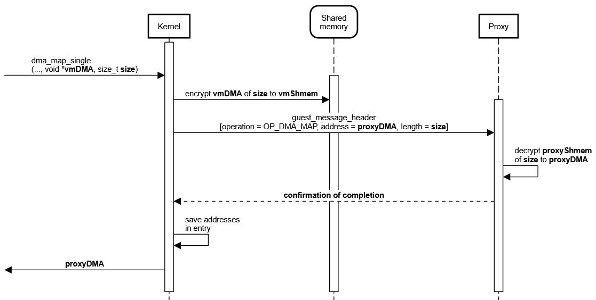
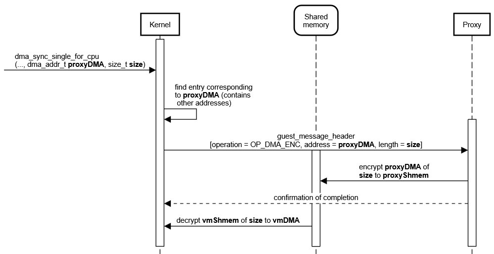
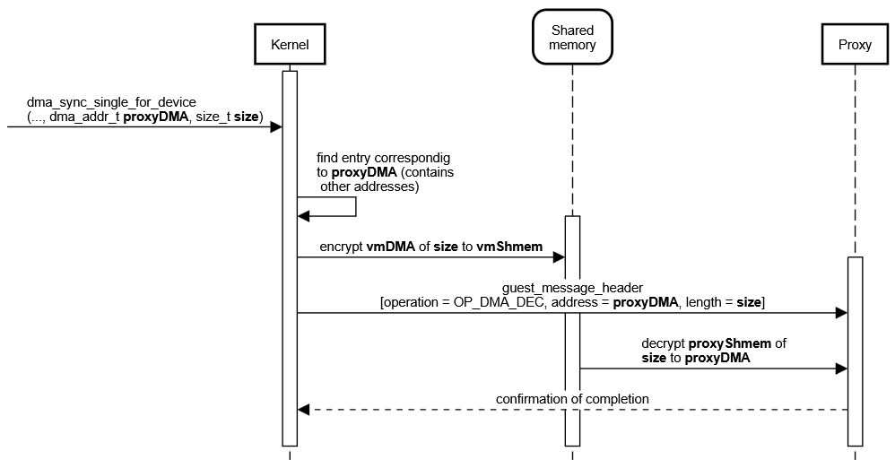
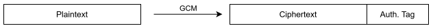
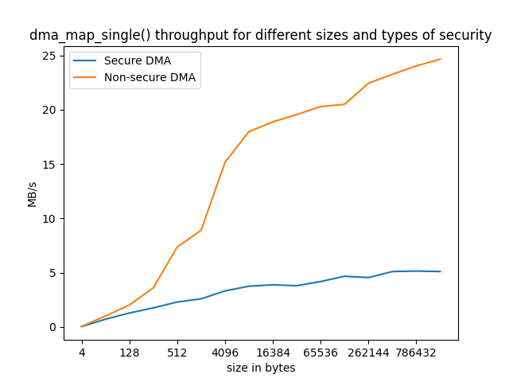

# Secure DMA documentation

This file documents the implementation of the secure DMA communication between VM and proxy process over shared memory.

## Setup

The confidential virtual machine (CVM), which contains the device driver, communicates with the proxy process, which hosts the EDU device.  
The [EDU device](https://www.qemu.org/docs/master/specs/edu.html) is a simple QEMU PCI device supporting basic functionality (e.g. DMA).  
All communication initiated by the driver to the device is intercepted by the kernel and converted into encrypted messages exchanged with the proxy process over the shared memory. This includes memory mapped I/O (MMIO, typically register-size) accesses (not documented here) and direct memory accesses (DMA).  
Right now the proxy process (a QEMU instance) is emulating the EDU device with [libvfio-user](https://github.com/nutanix/libvfio-user).

## Supported kernel DMA API-calls

This section provides information about the DMA-API calls currently supported (see [this section](#implementation-details-for-dma) for implementation details):

        dma_addr_t
        dma_map_single(struct device *dev, void *cpu_addr,
                       size_t size, enum dma_data_direction direction)
Expects a physically contigous virtual address of size, which is mapped and can be accessed by the device with the returned address.

        void
        dma_unmap_single(struct device *dev, dma_addr_t dma_addr,
                         size_t size, enum dma_data_direction direction)
Unmaps region which was previously mapped.  
(TODO: does the dma region has to be invalidated to prevent decryption if key leaks?)

        int
        dma_mapping_error(struct device *dev, dma_addr_t dma_addr)
Check if dma_map_single() produced an error. Only valid option to check if dma_map_single was successful.

        void
        dma_sync_single_for_cpu(struct device *dev, dma_addr_t dma_handle,
                                size_t size, enum dma_data_direction direction)
Synchronises the specified region for the cpu, i.e. updates it to the state which the devices currently sees.

        void
        dma_sync_single_for_device(struct device *dev, dma_addr_t dma_handle,
                                   size_t size, enum dma_data_direction direction)
Synchronises the specified region for the device, i.e. updates it to the state which the cpu currently sees.

## Implementation details for DMA

### Addresses overview

In order to understand the details of implementation, one first has to get an overview of the four different addresses:

The shared memory is a PCI device in case of the VM and a file on the host system in case of the proxy. In both scenarios the shared memory is mapped into address space (kernel virtual address space for VM, **vmShmem**; user virtual address space for proxy process, **proxyShmem**). This results in two different addresses for access to the shared memory region.

Additionally to that, there is the virtual address provided to dma_map_single(). This address (**vmDMA**) must have previously been acquired by a call to a kmalloc-like function, and points to a buffer which will be exposed to the device.

And then there is the dma_addr_t address (**proxyDMA**) returned by dma_map_single(), which gives the device access to this in-kernel buffer. This cannot be an address in the shared memory region as this is encrypted. That means there is another memory region in the proxy process, the size of the shared memory DMA region, which contains the unencrypted data. This DMA buffer is allocated during initialization of the proxy process.  
As this buffer is more or less a copy of the DMA region in the shared memory, with the difference of this one being plaintext data, one just has to add a constant offset to the shared memory address to get the proxyDMA address.

### Shared memory structure

The shared memory is divided into different regions.  
The first two bytes are doorbell registers, used to synchronize the sending/receiving of messages.  
The next bytes are reserverd for the [exchange of messages](#message-format) and other data (e.g. the value to write, in case of an MMIO write, or additional addresses for dma_syncs). The size of this region depends on the maximum message size, which is 13 bytes for a [struct_message_header](#message-format), and on the appended [authentication tag](#security), which is 16 bytes.  
Starting from the 31th byte are padding bytes until the start of next page (in our case 4K pages).  
The rest of the shared memory, from page 2 onward (i.e. starting at the 4096th byte), is available to DMA allocations.

Right now the shared memory is limited to a size of 1MB. This can be adjusted at will and requires only small modifications.

With exception to the doorbell registers, all data written to the shared memory is encrypted and contains an [authentication tag](#security).

#### Management of available space

The space, not used in a mapping, is called 'free'. Those free spaces are tracked in a linked list.  
Whenever a new mapping request is received, this free list is searched for the first big enough region (**First fit**).  
With an unmap the newly freed region is inserted back into the list and made available for future mappings.

### Message format

The messages send by the VM to the proxy over the shared memory do follow a specific format:

        struct guest_message_header {
                uint8_t operation;
                uint64_t address;
                uint32_t length;
        };

There a several types of operations. Those that are used in the DMA implementation are explained [below](#protocol-sequence-diagram). The other ones are used for MMIO and are not documented here.

### In-kernel entry structure

To keep track of all DMA mappings and their addresses, the kernel manages a red-black tree, which consists of entry nodes:

        struct disagg_dma_entry {
                struct rb_node node;
                void *vmDMA;
                dma_addr_t proxyDMA;
                size_t size;
        };

Those entries are only kept kernel-side, not on the proxy.

Of the addresses only the vmDMA could be any value. proxyDMA is surely in a specified range. That means when saving just proxyDMA, both vmShmem and proxyShmem can be calculated by adding an offset to proxyDMA.  
Those entries are needed in order to be able to fulfill requests to the [sync-API](#protocol-sequence-diagram), as the caller only provides the proxyDMA address. So we first have to get corresponding addresses to know where we have to do encryption/decryption/copying from/to.  
As soon as the region is unmaped, the entry is removed from the red-black tree.

### Protocol (sequence diagram)

The following sequence diagrams depict the things happening after calling one of the supported DMA API functions.
The messages and data are all exchanged through the shared memory in a confidential/authenticated/integer way, which is omitted in the sequence diagrams.  
As there are many addresses, pointing to the different address spaces, in play, [this](#addresses-overview) naming convention is used.  

#### dma_map_single

#### dma_snyc_single_for_cpu

#### dma_sync_single_for_device

The sync API also accepts addresses not being the same as an address returned my dma_map_single. The provided address just has to be within the mapped region. This allows to just update a subset of data. The sequence diagrams do not show that explicitely.

## Security

Because one of our design goals is security, the data written into the shared memory has to undergo some modifications. In our case we use [GCM-AES-256](https://nvlpubs.nist.gov/nistpubs/Legacy/SP/nistspecialpublication800-38d.pdf) as an AEAD method. The modifications are:

  1. Encryption: all data is encrypted with AES-256 in counter mode
  2. Authentication: a tag is created, which can be used to ensure integrity and authentication

Right now, the key is a hard-coded value. The secure key exchange will be added later.

GCM needs an initialization vector (IV) as an input to AES CTR mode. We provide a counter as an IV, which we [increment after every operation](https://nvlpubs.nist.gov/nistpubs/Legacy/SP/nistspecialpublication800-38d.pdf#page=28) (i.e. encrypt/decrypt). This ensures different ciphertexts for the same plaintexts, even if the key is the same. By providing a 12-byte IV there is [no need for an additional GHash](https://nvlpubs.nist.gov/nistpubs/Legacy/SP/nistspecialpublication800-38d.pdf#page=23).  
The way this works is that 32 bits (to be precise 0^31 || 1) are appended to the IV to result in 128 bits. This 32-bits value is then [incremented after every internal block encryption](https://csrc.nist.rip/groups/ST/toolkit/BCM/documents/proposedmodes/gcm/gcm-spec.pdf#page=6). Thus incrementing our own IV after every operation ensures different ciphertext for same plaintext.

There are two encrypted sections in the [shared memory](#shared-memory-structure), one being the messages exchanged during a [protocol](#protocol-sequence-diagram), and the other being the DMA region. To handle this there are two different counters (and therefore different IVs), one for each of those types.  
(TODO: Create different keys for MMIO/DMA with KDF as otherwise there might be the same plain-/ciphertext pair)

### Structure

Every write to the shared memory will append the authentication tag to the encrypted data:

When decrypting the data into trusted memory the authentication tag is checked.

As [this section](#protocol-sequence-diagram) states, the sync API also allows partial syncs. As the authentication tag is appended directly to the ciphertext it is possible that ciphertext, created during a previous DMA operation, is overwritten by the tag. This is no problem, as the ciphertext and tag are only read once. This happens in a synchronized manner.

### Crypto Implementation Libraries

The VM uses the in-kernel crypto API, which provides an implementation of GCM-AES-256.  
The proxy (running in userspace) relies on an OpenSSL crypto library implementation of GCM-AES-256.

## Benchmarks

The x-axis shows the size of the mapped DMA buffer.

As expected, the introduction of safety features, in the form of GCM-AES, does add a significant overhead.
